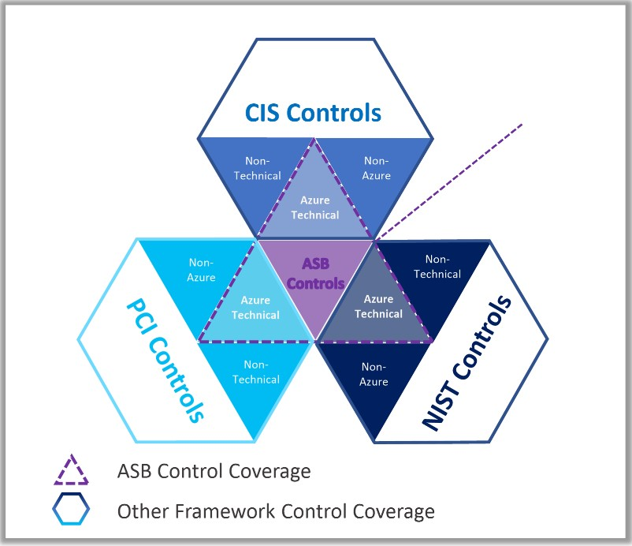

# Azure Governance and Policy
## Overview
Through the thought process and design of the Management Group and Subscription structure the topic of policies is inevitably going to come up.  That is because the biggest function of Management Groups is application of Azure Policies and Azure RBAC.  It can be difficult to envision the ideal Management Group structure for an organization until there is a clear understanding of Governance and Compliance requirements.  Organization should start with a familiar controls framework like CIS, NIST CCM etc and review the corresponding Azure Benchmark and look for controls where there might be deviations or different baselines based on the workload.  These scenarios might lead to requirements to have separate management groups.  For instance, an organization may choose to restrict which azure services are available in production environments based on an internal service approval process.  However, they may choose to allow those services to be used in a sandbox environment that has no connectivity to production or production data.  This is a common example and would result in a separate management group for sandbox workloads.  

## Sections
* [Governance Risk and Compliance](#governance-risk-and-compliance)
* [Azure Policy](#azure-policy)

---
---
# Governance Risk and Compliance
## Summary
One of the very first topics that comes up with almost every organization is cloud Governance Risk and Compliance  or in smaller orgs, simply "security" (GRC+).  This word means a lot of different things to different people.  For a more mature organization GRC+ involves a full review of vendor compliance documentation like SOC reports etc (Service Trust Portal).  For a smaller organization it might simply mean applying a benchmark or checklist such as the Azure Security Benchmark.  In regulated industries, regardless of the size of the organization, the process is almost always the former.  For the purposes of this discussion, we will recap at a very high level the common components of a GRC program to provide context and frame the discussion around GRC in Azure and where Azure tools such as Azure Policy can assist.

At a VERY basic level GRC can be summarized as

* Governance
	* What do you need to do?
	* Why do you need to do it?
	* What are you going to do?
	* How are you going to do it?
* Risk
	* What did you / are you doing?
	* Why did you do what you did, how you did it?
* Compliance
	* What did you / are you doing?
	* Did you / Are you do what you said you were going to do?
	* Did you / Are you doing what you are supposed to do?

---
---

# Azure Policy
## Summary
Within the Azure cloud there are generally speaking, Azure technical controls, non-Azure controls, and non-technical controls.  Azure Policy is a service within Azure to help organizations meet their GRC requirements for Azure technical controls.  It allows for the audit, reporting and enforcement of a wide range of technical controls in an organizations Azure estate.  In addition there are pre-built "initiatives" which are collections of controls mapped to common frameworks like CIS, NIST, FedRAMP, or PCI that allow an organization to quickly get started.  Azure Policy can assist with multiple functions within the GRC+ framework; it can document and enforce controls (Governance), audit controls (Compliance), and it can even provide risk scores based on level of compliance to applied frameworks. While the pre-built initiatives provide a great foundation for an organization to start from there will still be non-azure controls and non-technical controls that an organization will need to consider.

There is no easy button and just as with any new technology, an organization still must follow the processes and exercises that look at controls from an organizational lens to arrive at organizational specific controls (control mapping).  

## Key Points
* Order of Evaluation
    * All policies that would apply to a resource are aggregated and evaluated at once resulting in cumulative most restrictive 
	* Disabled --> Append/Modify --> Deny --> Audit
		* All processing stops on a Deny such that Deny trumps
	* DeployIfNotExists and AuditIfNotExists occur 10 min (customizable) AFTER the resource has been deployed
* Behaviors differ for New and Existing resources
	* Deny on an existing resource will flag a resource non-compliant but will not modify it
	* DeployIfNotExists on an existing resource will flag a resource as non-compliant but will not modify it
		* Remediation can be triggered within the portal or via powershell on a per POLICY basis
		* Remediation cannot be triggered on an Initiative basis
* Evaluations on new deployments happen on a per resource basis NOT cumulative to the entire deployment
	* This can result in some resources being deployed while others fail later in the deployment
* Evaluation frequency is 24hrs
* Evaluations can be triggered ad-hoc via powershell
* Exemptions can be created at various scopes and are inherited.
* Policies, initiative assignments and exemptions are inherited down but scope assignment does not matter
    * Conflicting policies will simply result in an inability to create resources
* Azure Deny Assignments can only be created as part of blueprints.  They are not a part of Azure Policy but rather Azure RBAC.
* Most of the controls in the pre-built Azure Initiatives are audit only!
## Best Practices
* Identify a controls framework to start with that the organization is familiar with and review the Azure Benchmark (checklist) for that controls framework
* Remember that, while checklists are a great starting point, in the GRC+ lifecycle, checklists are pretty far down the line and generally organization specific so be sure to do a control mapping to the organizations controls.
* Apply the benchmark in "audit" only mode to get a feel for current state initially
* Create a new Azure Policy Initiative for enforcement actions and start to build the organizational initiative.
* Avoid using exemptions as they become unmanageable
* Avoid applying at the resource and resource group scope (stick to management group and subscription where possible)
* Use resource locks to protect critical infra components that are not modified frequently (Express Route)
* Do not try to do everything at once, start with the most common/core controls.  Examples would be
	* Logging, 
	* Region
	* VM SKU
	* Approved Services
	* Public IP usage.
* Do not try to apply all the production controls in sandboxes, develop a strategy for production vs non-production to reduce friction for developers.  Example
	* Sandbox - audit controls and report/alert on incorrect controls
	* Non-Prod/QA  - remediate non-compliant configuration and alert/notify to fix CI/CD
	* Prod - Deny non-compliant configuration
* Apply the Azure Security Benchmarks in audit mode in addition to organizational benchmark.
    * These are updated by Microsoft.  They do no harm to apply and can sometimes highlight control gaps in the organization.
## Checklist
- [ ]Have you decided on a Benchmark/Checklist to use as a starting point
- [ ]Have you reviewed each control in the Benchmark to understand it
- [ ]Have you done a control mapping of each control to map to organizational policies (and update the control where necessary)
- [ ]Have you applied the base benchmark/checklist to your org in audit mode and reviewed findings
- [ ]Have you identified the first 5 most critical controls you will want to start enforcing via policy
- [ ]Have you come up with a policy/management group/subscription strategy (how will you structure management groups to align with policy and how will you apply policies to align with management groups)
- [ ]Have you identified a strategy for prod vs non-prod
- [ ]Have you started to apply the bare minimum guardrails
## Links
* [How to Create Azure Monitor Alerts for Non-Compliant Azure Policies](https://techcommunity.microsoft.com/t5/itops-talk-blog/how-to-create-azure-monitor-alerts-for-non-compliant-azure/ba-p/713466)
* [Overview of Azure Policy - Azure Policy | Microsoft Docs](https://docs.microsoft.com/en-us/azure/governance/policy/overview)
* [Governance in the Microsoft Cloud Adoption Framework for Azure - Cloud Adoption Framework | Microsoft Docs](https://docs.microsoft.com/en-us/azure/cloud-adoption-framework/govern/)
* [Regulatory Compliance details for CIS Microsoft Azure Foundations Benchmark 1.3.0 - Azure Policy | Microsoft Docs](https://docs.microsoft.com/en-us/azure/governance/policy/samples/cis-azure-1-3-0)
* [Azure Security Benchmark | Microsoft Docs](https://docs.microsoft.com/en-us/security/benchmark/azure/)
* [Azure Governance Heat Map (azurecharts.com)](https://azurecharts.com/heatmap?for=governance)
* [AzAdvertizer Other](https://www.azadvertizer.net/other.html)
* [Sample Azure Policy Scripts | github](https://github.com/JimGBritt/AzurePolicy/tree/master/AzureMonitor/Scripts)
* [Understand Azure deny assignments - Azure RBAC | Microsoft Docs](https://docs.microsoft.com/en-us/azure/role-based-access-control/deny-assignments)
## Learning
* Mslearn
	* [Design an enterprise governance strategy - Learn | Microsoft Docs](https://docs.microsoft.com/en-us/learn/modules/enterprise-governance/)
	* [Build a cloud governance strategy on Azure - Learn | Microsoft Docs](https://docs.microsoft.com/en-us/learn/modules/build-cloud-governance-strategy-azure/)
	* [Configure Azure policy - Learn | Microsoft Docs](https://docs.microsoft.com/en-us/learn/modules/configure-azure-policy/)
* Videos
	* [Microsoft Azure Master Class Part 3 - Governance](https://www.youtube.com/watch?v=cIh_Nfl67T0&t=53s)
	* [AZ-900 Episode 31 | Azure Policy](https://www.youtube.com/watch?v=9WO4EBgUJXk)
	* [Introduction to Azure Policy](https://www.youtube.com/watch?v=PfrJA6vHGKI)
	* [Azure Policy Definition](https://www.youtube.com/watch?v=QNwS_XiaNMc)
* Premiere Workshops
	* Activate Azure with Administration & Governance (https://datasheet.azureedge.net/offerings-datasheets/8230/EN.pdf)
	* Modern Service Management Governance for Azure (https://datasheet.azureedge.net/offerings-datasheets/9005/EN.pdf)