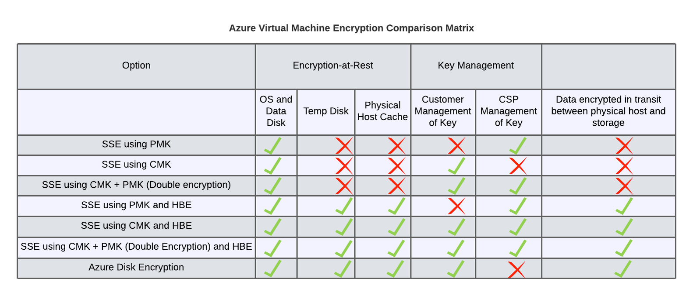

# Azure VM and Storage Encryption

## Overview
The topic of Azure encryption can be large and should ideally be addressed on a per service basis.  For the purposes of this section the scope is limited to Virtual Machine encryption and Azure Storage encryption as they are the two services most customers adopt early.

## Sections
* [Virtual Machine Disk Encryption](#virtual-machine-disk-encryption)

---
---

# Azure Virtual Machine Encryption
## Summary
There are a number of options when determining the type and level of encryption for azure VM managed disks.  Every disk is encrypted at rest, regardless of whether the customer chooses any additional options.  Generally speaking, the choice then comes down to whether the customer has additional organizational requirements that would necessitate additional assurances at the expense of operational overhead.
## Key Terms
* [Platform Managed Keys (PMK)](https://docs.microsoft.com/en-us/azure/virtual-machines/disk-encryption#platform-managed-keys)
    * By Default all managed disks are encrypted at rest using platform managed encryption keys
    * Microsoft manages the full lifecycle of the keys and the customer does not need to perform any maintenance
    * Customer does not have any control over the PMKs

* [Customer Managed Keys (CMK)](https://docs.microsoft.com/en-us/azure/virtual-machines/disk-encryption#full-control-of-your-keys)
    * Allows you to use your own encryption keys to protect Azure Managed Disks.  
    * The keys are stored in Azure Key Vault
    * Customer is responsible for the lifecycle of the keys
    * Azure Disk Encryption Sets are used to scope Keys to Disks to VMs.
    * The process to rotate the key version, and migrate encrypted disks to the new key is currently manual
    * [Automatic Key Rotation to the latest version](https://docs.microsoft.com/en-us/azure/virtual-machines/windows/disks-enable-customer-managed-keys-powershell#) allows you to automatically migrate the key used to encrypt disks once the Key version has been incremented in the keyvault.
    * [Key Rotation Policy](https://docs.microsoft.com/en-us/azure/key-vault/keys/how-to-configure-key-rotation) is in PREVIEW at the moment but will allow for automatic rotation based on key lifetime policy.
* [Server Side Encryption (SSE)](https://docs.microsoft.com/en-us/azure/virtual-machines/disk-encryption)
    * Azure Managed Disks (OS and Data) are encrypted at rest on Azure Storage
    * This is the default unless Azure Disk Encryption is used
    * Supports Platform Managed keys (PMK), Customer Managed Keys (CMK), or Double Encryption with both PMK and CMK
    * Cannot be used with Azure Disk Encryption
    * All encryption occurs outside of the VM, is transparent to the user, and incurs no overhead
    * Can be used in conjunction with Hosted Based Encryption
* [Host Based Encryption (HBE)](https://docs.microsoft.com/en-us/azure/virtual-machines/disks-enable-host-based-encryption-portal)
    * Azure Managed Disks (OS, Data, and Temp) are encrypted at rest on the host and in transit to the storage service
    * Feature must be enabled on each subscription to be available
    * Cannot be used with Azure Disk Encryption
    * CAN be used in conjunction with Server Side Encryption
    * All encryption occurs outside of the VM, is transparent to the user, and incurs no overhead
    * Can be used with Customer Managed Keys or Platform Managed Keys
* [Azure Disk Encryption (ADE)](https://docs.microsoft.com/en-us/azure/security/fundamentals/azure-disk-encryption-vms-vmss)
    * Enables end to end encryption of VM Disks
    * Supports both windows and linux vms ([Not all VM sizes and OS are supported](https://docs.microsoft.com/en-us/azure/virtual-machines/windows/disk-encryption-overview#supported-vms-and-operating-systems))
    * Cannot be used with SSE or BHE
    * Encryption occurs within the guest OS and incurs CPU utilization
## VM Disk Encryption Options

## Key Points
* Server Side Encryption with Platform Managed Keys (Default) + Host Based Encryption ensures all customer data is encrypted at rest with zero additional customer overhead
* Platform Managed Keys (SSE or ADE) provide additional control over the keys and potentially additional security but ONLY IF YOU ROTATE THEM.  So consider the additional overhead before going the CMK route.
* Rotation of Customer Managed Keys can b
## Best Practices
* Enable Host Based Encryption on all subscriptions
* Leverage Platform Managed Keys where possible and where policy permits to aleviate operational overhead
* Review organizational key management policies in the context of cloud leveraging the [Service Trust Portal](https://servicetrust.microsoft.com/) and where necessary update policy for the cloud
* Use Azure Policy to Audit and Enforce Azure Managed Disk Encryption policy
## Checklist
- [ ] What are the Key Management requirements?
    - Minimum Key Lifecycle
    - Key Rotation Frequency
    - Key Custody
- [ ] Is the decision to use Azure Disk Encryption or Server Side Encryption
- [ ] Has Host Based Encryption been enabled on all subscriptions?
- [ ] Has a process been established to enable HBE on all future subscriptions?
- [ ] Has an Azure Policy been setup to audit and/or enforce the organizations chosen pattern?
	
## Links
* [Disk Encryption Overview| Microsoft Docs](https://docs.microsoft.com/en-us/azure/virtual-machines/disk-encryption-overview)
* [Host Based Encryption | Microsoft Docs](https://docs.microsoft.com/en-us/azure/virtual-machines/disks-enable-host-based-encryption-portal)
* [Enable SSE with CMK on Managed Disks| Microsoft Docs](https://docs.microsoft.com/en-us/azure/virtual-machines/disks-enable-customer-managed-keys-portal)
## Learning
* Mslearn
	* [Securing Data at rest on Azure | MS Learn](https://docs.microsoft.com/en-us/learn/modules/secure-data-at-rest/)
	* [Configure Storage Security | MS Learn](https://docs.microsoft.com/en-us/learn/modules/configure-storage-security/)
	* [Azure Key Vault | MS Learn](https://docs.microsoft.com/en-us/learn/modules/azure-key-vault/)
* Videos
	* [Azure Disk Encryption Deep Dive](https://www.youtube.com/watch?v=EOXgzTqceok)
	* [Azure Disk Encryption Overview](https://www.youtube.com/watch?v=TUSt5XeH9OE)
	* [SSE with CMK](https://www.youtube.com/watch?v=uSrrkdNMp2k)
## Premiere Workshops
* [WorkshopPLUS - Microsoft Azure: Storage 1 Day with Lab](https://datasheet.azureedge.net/offerings-datasheets/8197/EN.pdf)
* [WorkshopPLUS Remote - Microsoft Azure: Storage 1 Day with Lab](https://datasheet.azureedge.net/offerings-datasheets/9910/EN.pdf)